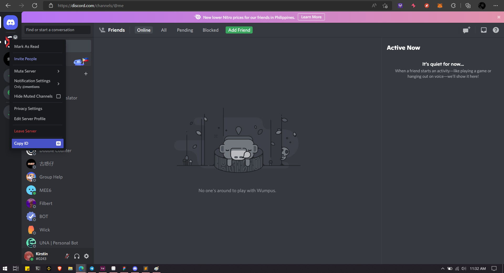

# Discord leave server

This guide will walk you through the process of how to leave multiple user guild

## First we need to get auth_token

## Step 1: Open Discord in Your Browser

To get started, open Discord in your preferred web browser.

## Step 2: Access Developer Tools

Press CTRL+SHIFT+I or F12 to open the developer tools. Then, select the "Network" tab.

## Step 3: Filter Requests

After opening the developer tools, refresh the Discord page by pressing F5 or by manually reloading the page. Next, type `/api` in the filter bar to narrow down the requests. Select any of the requests that appear.

## Step 4: Retrieve Token

Scroll down through the request details until you find the "Authorization" section. Copy the token displayed. **WARNING: DO NOT SHARE YOUR DISCORD TOKEN WITH ANYONE.**

## Step 5: Enable Developer Mode

In Discord, navigate to your settings. Scroll down and select "Advanced." Then, toggle on "Developer Mode."

## Step 6: Copy Server ID

Close the settings window and return to the Discord interface. Right-click on the server you wish to whitelist and select "Copy ID."

Now you have successfully retrieved your Discord token and server ID for further use.
